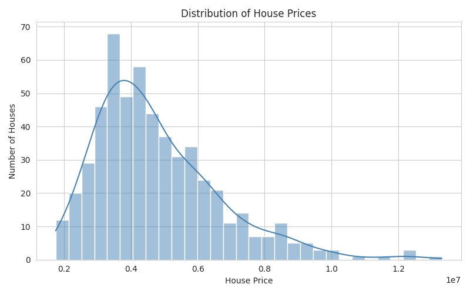
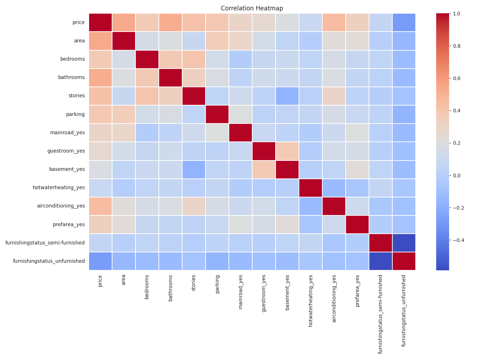
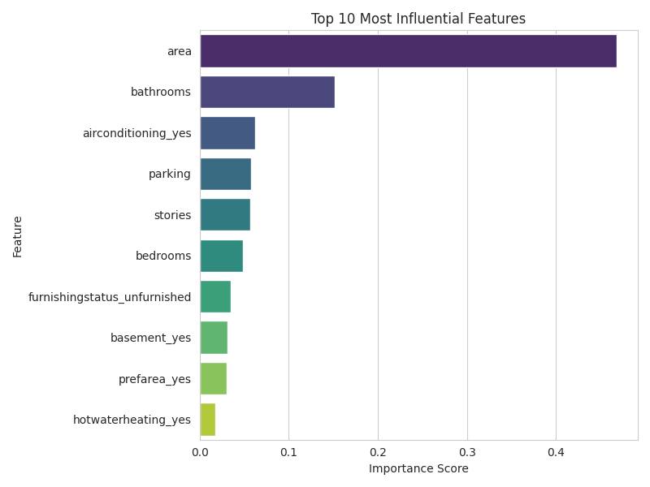

# House Price Prediction

In this project, I built a machine learning model to predict house prices. I used a dataset with different property features like total area, number of bedrooms, bathrooms, and other amenities to see what actually drives a house's value up.

### What is this project about?
Pricing a house isn't easy. I wanted to see if a machine learning algorithm could accurately estimate a property's selling price. Along the way, the goal was also to figure out which specific features—like adding an extra bathroom or having air conditioning—impact the final price the most.

### The Data
I worked with a dataset containing 545 houses. For each house, there are 13 different features recorded:
- **Target Variable (What we are predicting):** `price`
- **Numerical Features:** `area`, `bedrooms`, `bathrooms`, `stories`, `parking`
- **Categorical Features:** `mainroad`, `guestroom`, `basement`, `hotwaterheating`, `airconditioning`, `prefarea`, `furnishingstatus`

### Tools I Used
- **Python** (Jupyter Notebook)
- **Pandas & NumPy** for handling and cleaning the data
- **Matplotlib & Seaborn** to create the charts
- **Scikit-Learn** for the machine learning models (Linear Regression and Random Forest)

### How to Run It
If you want to run my code on your own machine:
1. Clone this repo or download the files.
2. Install the required packages by running `pip install -r requirements.txt` in your terminal.
3. Open up `jupyter notebook` and run the cells!

### Data Visualizations
Before building the models, I created a few charts to understand the data better.

**Distribution of House Prices:**
Most houses were moderately priced, with a few really expensive luxury homes pulling the average up.

**Correlation Heatmap:**
This helped me see which features were mathematically linked to the price. Area and Bathrooms had the highest correlation!

### Workflow & Results
I cleaned the data, used One-Hot Encoding for the text categories, and split the data into 80% training and 20% testing sets. Here is what I learned after training the models:

- **Size is everything:** The total `area` of the house is the biggest factor that pushes the price up.
- **Bathrooms matter more than bedrooms:** Adding a bathroom actually boosts the house value more than adding an extra bedroom.
- **Linear Regression won:** Surprisingly, the simpler Linear Regression model performed better (about 65% R² score) than the more complex Random Forest model. The Random Forest model ended up overfitting because the dataset was pretty small (only 545 rows).

**Feature Importance Plot:**
Here is a chart showing what the model thought was most important when deciding a house's price:

